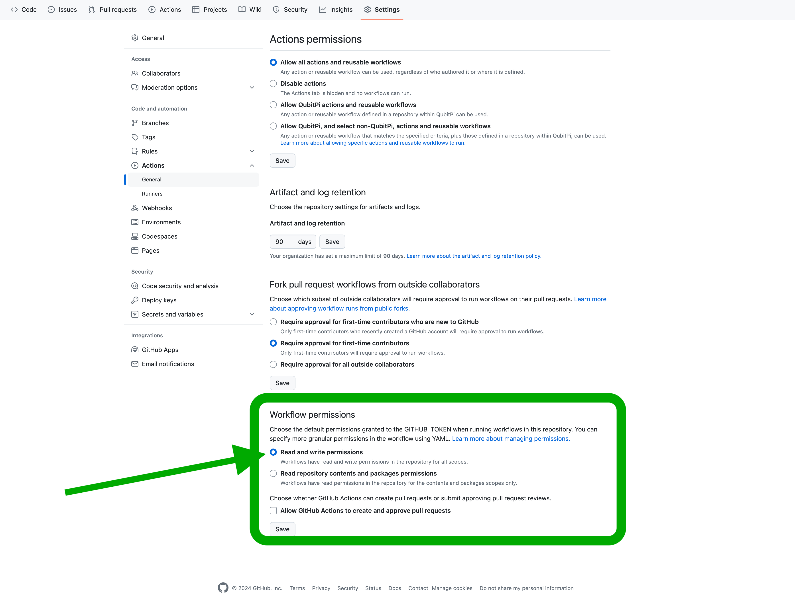

[Community Health Files](https://docs.github.com/en/communities/setting-up-your-project-for-healthy-contributions/creating-a-default-community-health-file)
======================

- [Pull request template](./pull_request_template.md)
- [Issue templates](.github/ISSUE_TEMPLATE)
- [Code of Conduct](./CODE_OF_CONDUCT.md)

Centralized Scripts
-------------------

### Bumping Semantic Version by GitHub Tag

> [!IMPORTANT]
> The GitHub repository must grant _write_ access to this workflow permission, i.e. navigate to __Settings__ ->
> __Actions__ -> __General__; under _Workflow permissions_ make sure __Read and write permissions__ is checked:
>
> 

#### Step 1 - Manually Creating the First Tag:

```cnosole
git tag -a v0.0.1 -m "v0.0.1"
git push origin v0.0.1
```

### Step 2 - Update CI/CD

Create a pull request that adds a new job with the following two steps to GitHub Action

```yaml
"on":
  pull_request:
  push:
    branches:
      - master

jobs:
  my-job:
    ...
    steps:
      - name: Download auto-version bump scripts
        run: |
          git clone https://github.com/generation-software/.github.git ../scripts
          cp ../scripts/.github/version-bump/tag-for-release.bash .github/
          cp ../scripts/.github/version-bump/upversion.py .github/
      - name: Tag for release
        run: |
          git config --global user.name '$USER'
          git config --global user.email '$EMAIL'
          .github/tag-for-release.bash
    ...
```

Taking npm release as an example

```yaml
---
name: CI/CD

"on":
  pull_request:
  push:
    branches:
      - master

env:
  USER: QubitPi
  EMAIL: jack20220723@gmail.com

jobs:
  release:
    name: Publish NPM Packages
    if: github.ref == 'refs/heads/master'
    runs-on: ubuntu-latest
    steps:
      - uses: actions/checkout@v3
        with:
          fetch-depth: 0
      - name: Set node version to 18
        uses: actions/setup-node@v3
        with:
          node-version: 18
          registry-url: "https://registry.npmjs.org"
      - name: Download auto-version bump scripts
        run: |
          git clone https://github.com/generation-software/.github.git ../scripts
          cp ../scripts/.github/version-bump/tag-for-release.bash .github/
          cp ../scripts/.github/version-bump/upversion.py .github/
      - name: Tag for release
        run: |
          git config --global user.name '$USER'
          git config --global user.email '$EMAIL'
          .github/tag-for-release.bash
      - name: Set release version
        run: |
          VERSION=$(git describe)
          npm version $VERSION
      - name: Publish to NPM Packages
        run: |
          npm config set '//registry.npmjs.org/:_authToken' "${NPM_TOKEN}"
          npm publish --access public
        env:
          NPM_TOKEN: ${{ secrets.NPM_TOKEN }}
```

When the pull request is merged, the version bump action will automatically create and push a new version tag of
`MAJOR`.`MINOR`.(`PATCH` + 1)

> [!TIP]
>
> Bumping the `MAJOR` or `MINOR` version still needs to be done manually using `git tag -a vx.x.x -m "vx.x.x"` command
> given the assumption that agile software development will change patch version most frequently and almost always
